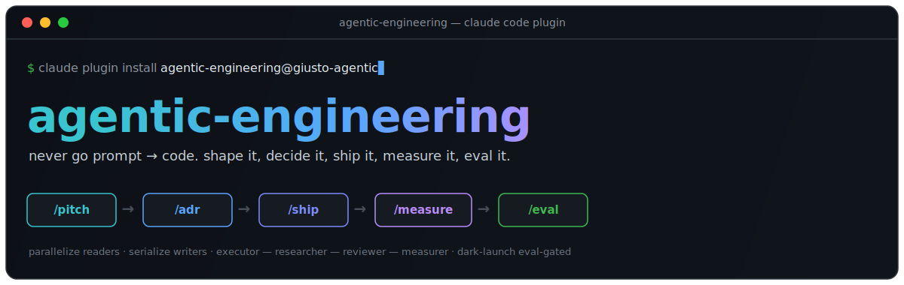

<div align="center">



<h1 align="center">agentic-engineering</h1>

[](https://github.com/GiustoPiedimonte/agentic-engineering-marketplace)
[](https://github.com/GiustoPiedimonte/agentic-engineering-marketplace/actions/workflows/validate.yml)
[](https://github.com/GiustoPiedimonte/agentic-engineering-marketplace/releases)
[](https://github.com/GiustoPiedimonte/agentic-engineering-marketplace/blob/main/LICENSE)

**A spec-driven workflow for building with coding agents.**
Never go prompt → code: *shape → decide → execute → measure → eval.*

[Install](#install) · [Quickstart](#quickstart) · [What you get](#what-you-get) · [Plugin reference](plugins/agentic-engineering/README.md) · [Claude Code docs](https://code.claude.com/docs/en/plugin-marketplaces)

</div>

---

```text
   shape          decide          execute          verify          diagnose
 ┌─────────┐   ┌─────────┐    ┌──────────┐    ┌───────────┐    ┌──────────┐
 │ /pitch  │──▶│  /adr   │──▶ │  /ship   │──▶ │ /measure  │──▶ │  /eval   │
 │ the spec│   │ the why │    │ the cycle│    │ the data  │    │ the modes│
 └─────────┘   └─────────┘    └──────────┘    └───────────┘    └────┬─────┘
      ▲                                                              │
      └───────────────  flip-criteria · real failures  ◀────────────┘

   readers fan out · one writer at a time · review is a gate · data decides
```

## Contents

- [Why this exists](#why-this-exists)
- [Install](#install)
- [Quickstart](#quickstart)
- [What you get](#what-you-get)
- [Requirements](#requirements)
- [Customize per repo](#customize-per-repo)
- [Maintaining](#maintaining)
- [Also in this marketplace](#also-in-this-marketplace)
- [Contributing](#contributing)
- [License](#license)

## Why this exists

Coding agents make it cheap to go from a prompt straight to a diff — and that's
exactly the trap. Unshaped work balloons in scope, decisions get lost, and a
green build gets mistaken for a correct one.

This plugin encodes a different discipline, distilled from a real, opinionated
agentic-engineering practice: **shape the work into a written spec first, record
the hard decisions, delegate execution to a single serialized writer with an
adversarial reviewer as a gate, and let real data — not a passing test — decide
what ships.** Five skills, four subagent roles, and verification hooks make that
discipline portable to any repo.

> [!NOTE]
> These are early, opinionated tools — structurally validated and dogfooded on
> this repo, not yet battle-tested across many. Feedback and issues are welcome.
> Distributed as a Claude Code *marketplace* named `giusto-agentic`; one
> marketplace can host many plugins.

## Install

In Claude Code:

```text
/plugin marketplace add GiustoPiedimonte/agentic-engineering-marketplace
/plugin install agentic-engineering@giusto-agentic
```

<details>
<summary>CLI equivalent</summary>

```bash
claude plugin marketplace add GiustoPiedimonte/agentic-engineering-marketplace
claude plugin install agentic-engineering@giusto-agentic
```
</details>

The five commands and four agents become available. New components load on your
next Claude Code session.

## Quickstart

A typical end-to-end cycle, from idea to merged code:

1. **Shape it.** `/pitch "add Google OAuth to login"` — an interview produces
   `docs/pitches/oauth.md`. Approve the shape before any code is written.
2. **Decide it.** `/clear`, then `/adr` if a consequential choice was made (e.g.
   session strategy). Behavior-altering work records a `Flip-criteria`.
3. **Ship it.** `/clear`, then `/ship oauth` — the `executor` implements and opens
   a PR; the `reviewer` checks the diff against the pitch in a fresh context; you
   fix the real gaps and merge.
4. **Prove it.** Behavior-altering changes ship dark (flag-OFF), then `/measure`
   against the recorded criterion flips them on — on real data, not a green build.

> [!TIP]
> Run `/clear` between stages. Separating exploration, decision, and execution
> into clean contexts is the single biggest lever on output quality.

## What you get

### Skills — slash commands

| Command | What it does |
|---|---|
| `/pitch` | Shape a feature into a Shape Up pitch (the spec / source of truth) via interview, before any code. |
| `/adr` | Record a consequential decision in an append-only `docs/DECISIONS.md`, with optional dark-launch `Gate`/`Flip-criteria`. |
| `/ship` | Execute an approved pitch as a closed-scope cycle: pre-spawn filter, doc-bundle, standard PR format, adversarial review, dark-launch flip. |
| `/measure` | Unblock a decision with a read-only, data-backed flip/keep/cut verdict — never guesses, never writes. |
| `/eval` | Make eval the unit of progress: build the harness from *real* failures, localize where a pipeline breaks (transition-failure matrix), feed flip-criteria. |

### Agents — roles

The organizing law is *parallelize readers, serialize writers*: research and
review fan out across many agents; only one writer ever touches the code.

| Agent | Role |
|---|---|
| `executor` | The serialized writer: implements one closed scope, keeps build/tests green, opens a PR, never merges. |
| `researcher` | Fan-out, read-only research with cited, verified findings; prefers current docs over memory. |
| `reviewer` | Adversarial pre-merge gate; 8-check rubric; returns MERGE / ADJUST / REJECT. |
| `measurer` | Read-only data verdicts to unblock measure-gated decisions. |

### Hooks

- **PostToolUse** — auto-format/lint edited TS/Py files (only if `eslint`/`ruff` are present).
- **Stop** — when a turn leaves uncommitted changes, a gate that asks for the
  project's own verification output before ending (silent when the tree is clean).

> [!IMPORTANT]
> The Stop hook means a turn with uncommitted changes won't quietly end on "looks
> good." It asks you to run *this project's* checks (tests / build / lint, or a
> validate script) and show the output — verification is part of *done*. It stays
> silent on clean turns, and doesn't assume checks the repo doesn't have.

## Requirements

- **Claude Code** (CLI, desktop, or IDE extension).
- **`jq`** on your machine, for the format hook.
- *(optional)* A docs MCP such as [Context7](https://github.com/upstash/context7)
  so `researcher` / `/measure` can pull live library docs:
  `claude mcp add context7 -- npx -y @upstash/context7-mcp`.

## Customize per repo

The skills reference `docs/pitches/` and `docs/DECISIONS.md` by convention. Adapt
the doc-bundle tiers in
[`EXECUTION_PLAYBOOK.md`](plugins/agentic-engineering/skills/ship/references/EXECUTION_PLAYBOOK.md)
and the invariants in the review checklist to your project, and change the paths
if your repo differs. See the [plugin reference](plugins/agentic-engineering/README.md)
for the full component breakdown.

## Maintaining

Releasing an update: bump `version` in both
[`plugin.json`](plugins/agentic-engineering/.claude-plugin/plugin.json) and
[`marketplace.json`](.claude-plugin/marketplace.json), commit, tag, and push.
Users pick it up with `/plugin marketplace update giusto-agentic`.

Validate before pushing:

```bash
claude plugin validate .
claude plugin validate ./plugins/agentic-engineering
```

<details>
<summary>Repo layout</summary>

```text
agentic-engineering-marketplace/
├── .claude-plugin/
│   └── marketplace.json        # lists the plugin(s), schema-validated
├── assets/
│   └── banner.svg
├── plugins/
│   └── agentic-engineering/    # the plugin itself
│       ├── .claude-plugin/plugin.json
│       └── skills/  agents/  hooks/  README.md
├── LICENSE
└── README.md
```
</details>

## Also in this marketplace

[**github-keeper**](plugins/github-keeper/README.md) — make a public repo
well-made and honest. `/readme` audits and elevates the README (honest clickable
badges, repo-specific banner and chips, cognitive-funnel structure); `/opensource`
adds the community-health files, an honest CI gate, and the right repo settings.
Install it with `/plugin install github-keeper@giusto-agentic`.

## Contributing

Issues and PRs are welcome — bug reports, a sharper skill prompt, or a new
role/skill that fits the *shape → decide → execute → measure → eval* spine.
[Open an issue](https://github.com/GiustoPiedimonte/agentic-engineering-marketplace/issues)
to discuss anything non-trivial first. Run `claude plugin validate .` before
opening a PR.

## License

[MIT](LICENSE) © Giusto Piedimonte
